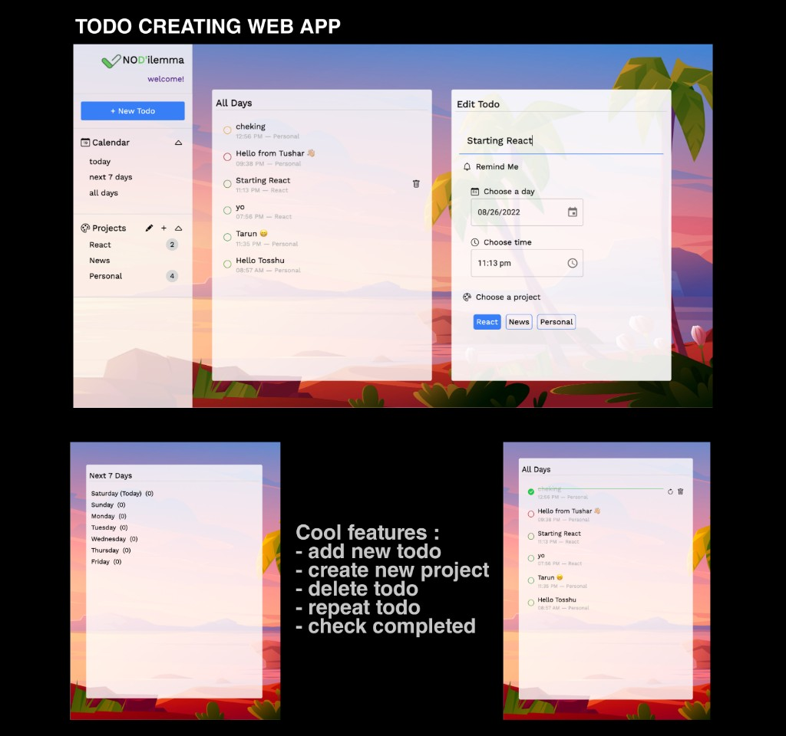

# Todo creating website Using ReactJs | Firebase | MUI

## [Check it live here](https://no-dilemma.netlify.app/)



No-Dilemma | Todo creating website build using React and Firebase.

## Tech Info of App

- React for UI
- Firebase as serverless DB
- React Router for Routing
- Bootstrap for styling
- MomentJs for Dates
- MUI

## Features

- add new todo
- add new project
- check completed
- delete todo
- edit todo
- repeat todo

## Getting Started

These instructions will get you a copy of the project up and running on your local machine for development and testing purposes. See deployment for notes on how to deploy the project on a live system.

### Installing

Clone the Repository and run

```
npm i
npm start
```

## Deployment

To deploy simply run

```
npm run build
```

## Built With

- React JS
- React-Router
- Firebase
- React context
- Custom Hooks

## Contributing

Please feel free to send pull request if you want to contribute!
